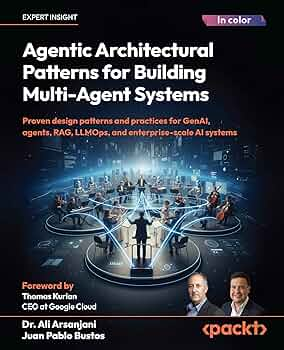

# Agentic Architectural Patterns for Building Multi-Agent Systems — Mapa del libro

<p align="center"></p>

> [!info] Ali Arsanjani
> Mapa de lectura de *Agentic Architectural Patterns for Building Multi-Agent Systems*. Abrí esta nota para la tesis del libro, el índice de capítulos y las ideas que cruzan toda la obra. Empezá por la tesis y bajá.

## 🎯 Tesis del libro

El libro sostiene que construir sistemas agénticos (single-agent y multi-agent) confiables y *production-grade* en la empresa no es cuestión de ensamblar componentes, sino de **aplicar patrones arquitectónicos repetibles** que gestionen sobre todo el contexto —el factor que separa un PoC de laboratorio de un sistema desplegable. El principio rector es *context is king*: la fiabilidad del agente depende de equipar su núcleo de razonamiento (un [[LLM]]) con el contexto correcto en el momento correcto.

El primer capítulo encuadra el viaje: desde las capacidades de GenAI hasta la anatomía del agente, el **GenAI Maturity Model** como hoja de ruta (Niveles 0–6) y el **stack de interoperabilidad** (function calling, [[MCP]], [[A2A]]) como vehículo para subir esa madurez, sin perder de vista los desafíos —datos, seguridad, governance, ROI— que frenan el paso a producción. El cap. 2 (**agent-ready LLMs**) baja al motor: cómo elegir, desplegar y adaptar el LLM (o conjunto de LLMs) que sirve de reasoning core —insistiendo en que ser "agent-ready" es mucho más que el mayor benchmark, y que un modelo chico especializado suele ganarle a uno grande según la tarea—. El cap. 3 (**spectrum of LLM adaptation**) completa el motor con el *cómo* especializarlo: un espectro de técnicas —RAG (contexto dinámico en inferencia), fine-tuning (PEFT→FFT, persistente), ICL (on-the-fly sin tocar pesos) y grounding (confiabilidad)— que rara vez se usan solas, más un Agentic Maturity Model y una arquitectura jerárquica (orquestador + sub-agents como AgentTools + callbacks) como blueprint. El cap. 4 (**agentic AI architecture**) cierra la Parte 1 dando el blueprint del agente como sistema: lo distingue del LLM (pasivo) y del workflow (rígido), formaliza su anatomía como bloques funcionales (Goals·Sense·Reason·Plan·Act·Memory·Coordinate) de un loop continuo, y describe los data stores y el stack de interacción (function calling → tool protocols/MCP → A2A) — el prerequisito de los design patterns de la Parte 2. El cap. 5 (**multi-agent coordination patterns**) abre esa Parte 2 con 12 patrones para que múltiples agentes colaboren: routing, delegación (Supervisor vs Swarm), topologías (Blackboard, Contract-Net, Supervision Tree), planning, knowledge sharing, tool routing, y la gestión de la fricción (consensus, negociación, resource allocation, conflict resolution, formation control) — bajo el principio de que *la coordinación se arquitectura, no se asume*. La parte de patrones operacionaliza esa tesis en dos niveles complementarios. El cap. 8 (**human-agent interaction patterns**) gobierna la interfaz con el usuario humano —el punto donde el sistema se encuentra con el mundo real— y sostiene que su objetivo último es *construir confianza*: interacciones diversas (transaccionales vs delegaciones complejas), escalación a humano como feature core (no fallo) y colaboración entre agentes invisible para el usuario, todo medible. El cap. 9 (**agent-level patterns**) baja un nivel más: el cómo se ingenia cada facultad de un agente individual (Act, Memory, Reason, Sense). Juntos muestran que la madurez se construye por capas, un patrón a la vez, y que tanto la relación humano-agente como el agente mismo son resultado de decisiones arquitectónicas deliberadas. El cap. 6 (**explainability & compliance**) agrega la dimensión de *trustworthiness* sistémica: cuatro patrones de accountability (Instruction Fidelity Auditing, FCoT Embedding, Persistent Instruction Anchoring, Shared Epistemic Memory) que combaten el *instruction drift* en jerarquías de agentes —*"autonomy without accountability is a liability"*— y cuya necesidad se profundiza al pasar de single a multi-agente. El cap. 7 (**robustness & fault tolerance**) cubre la otra mitad de production-grade: si el cap. 6 hace al sistema confiable en su *razonamiento*, el 7 lo hace resiliente en su *operación* con 13 patrones (recuperación reactiva, tolerancia adaptativa, auditabilidad, seguridad, eficiencia) en un maturity model de 5 niveles —*"plan for agent failure"*—. El cap. 10 (**system-level patterns**) hace el shift final del agente al *sistema que lo contiene*: el "mundo" de infraestructura en que los agentes viven —como una arquitectura de microservicios, pero con componentes razonadores y autónomos— con 4 patrones (Tool and Agent Registry para discovery, Real-Time Compliance Monitoring para governance, Agent Authentication and Authorization para identidad/seguridad, Event-Driven Reactivity para reactividad asincrónica), adoptados *progresivamente* según el Maturity Model: *"production readiness is an architectural choice"*. El cap. 11 (**advanced adaptation**) cierra el arco con el estadio más avanzado de madurez: agentes que *aprenden*, un shift de mindset de *construir* a *cultivar*. El **Self-Improvement Flywheel** (Generate→Evaluate→Learn→Deploy) y el **R⁵ model** (Relax·Reflect·Reference·Retry·Report) enmarcan 7 patrones —Hybrid Planner+Scorer, Custom Evaluation Metrics, Synthetic Data Generation (DPO), Advanced Tuning, Coevolved Agent Training, Adversarial Testing/Red Teaming, Cost Management/Tokenomics y ROI— para componer conocimiento *a escala de máquina*, sin que el loop auto-actualizable se vuelva un círculo vicioso de degradación. El cap. 12 (**practical roadmap**) cierra la Parte 2 respondiendo *"¿por dónde empiezo?"*: una hoja de ruta de **adopción progresiva** que ordena todos los patrones del libro en 3 niveles de madurez (L1 Foundational/monolítico → L2 Production-Ready/microservicios → L3 Self-Improving/closed-loop), más una guía de reflexión estratégica (siempre empezar por el MVA) — *"adopt progressively, align architecture with goals, strategy precedes implementation"*. El cap. 13 abre la **Parte 3 (use cases hands-on)** materializando toda la teoría en código: un agente **monolítico** que automatiza un loan origination pipeline con **Google ADK** + Gemini, usando el patrón **FCoT (Fractal Chain-of-Thought)** como núcleo cognitivo, y *exponiendo deliberadamente* sus límites (single point of failure, cognitive overload) para motivar el rediseño multi-agente — *"an effective agent is not merely prompted; it is engineered"*. El cap. 14 completa el use case refactorizando ese monolito en un **sistema multi-agente jerárquico (Level 4)** con la **Supervisor/Orchestrator Architecture** y **Agent Delegates to Agent** (`AgentTool`): promueve las tools a un crew de especialistas, agrega production guardrails y convierte al agente principal de *doer* a *manager* — *"the shift from a doer to a manager of specialized workers is the defining characteristic of Level 4"*. El cap. 15 cierra la práctica comparando **tres frameworks agénticos** (Google ADK, CrewAI, LangGraph) al reimplementar el mismo loan processing: cada uno encarna una *core abstraction* distinta (production agent / role-playing team / state machine), y el capítulo muestra cómo elegir según el problema, evitar el *framework lock-in* y apoyar el responsible AI en la observability — *"the framework is a tool to implement the patterns we've discussed"*. El cap. 16 **cierra el libro** sintetizando todo en un plan accionable: alinea los tres modelos de madurez (GenAI / Agentic Spectrum / Implementation), da un *playbook organizacional* y un *action plan personal del practitioner*, y consagra la tesis-bisagra: *"your goal is not to 'build an agent'; your goal is to 'solve a specific business problem' using an agent"* — la madurez es el resultado calculado de inversión intencional pattern-driven, no un accidente.

## 📖 Capítulos

| # | Capítulo | En una línea |
|---|---|---|
| 01 | [[01 - GenAI in the Enterprise - Landscape, Maturity, and Agent Focus]] | Landscape de GenAI en la empresa, *context is king*, aplicaciones (horizontales/verticales), anatomía del agente (Goals·Sense·Reason·Plan·Act·Memory·Coordinate), Modelo de Madurez (0–6, Tabla 1.2), stack agéntico (function calling/MCP/A2A) y desafíos para production-grade (caso de fracaso del Returns Agent). Con las 4 figuras del libro embebidas. |
| 02 | [[02 - Agent-Ready LLMs - Selection, Deployment, and Adaptation]] | El motor del agente: rol del LLM como reasoning core (ReAct/Reflexion/ToT), selección de modelo (11 dimensiones, grande vs chico, function calling, PEFT/LoRA), serving (cloud/self-hosted/edge), optimización (latencia/throughput/costo/seguridad) y AgentOps. |
| 03 | [[03 - The Spectrum of LLM Adaptation for Agents - RAG to Fine-tuning]] | El espectro de adaptación de genérico a especializado: RAG (contexto dinámico, 3 ejemplos enterprise), fine-tuning (PEFT vs FFT, SFT), ICL (few/many-shot on-the-fly) y grounding; + Agentic Maturity Model (6 niveles) y arquitectura jerárquica (orquestador/sub-agents/AgentTools/callbacks). |
| 04 | [[04 - Agentic AI Architecture - Components and Interactions]] | El blueprint del agente: qué lo distingue de LLM/workflow (jerarquía de autonomía), la anatomía como bloques funcionales (Goals·Sense·Reason·Plan·Act·Memory·Coordinate), data stores/contexto, modelos de interacción (directa/stigmergy) y el stack emergente (function calling→tool protocols/MCP→A2A). Cierra la Parte 1. |
| 05 | [[05 - Multi-Agent Coordination Patterns]] | 12 patrones de coordinación multi-agente: Agent Router, Task Delegation (Supervisor vs Swarm), topologías (Blackboard, Contract-Net, Supervision Tree), Multi-Agent Planning, Knowledge Sharing, Tool Routing, y la fricción (Consensus, Negotiation, Resource Allocation, Conflict Resolution, Formation Control). Mapeados al Agentic Maturity Model. |
| 06 | [[06 - Explainability and Compliance Agentic Patterns]] | Explicabilidad ("¿por qué?") y compliance ("¿siguió las reglas?") vía 4 patrones contra el *instruction drift* (Instruction Fidelity Auditing, FCoT Embedding, Persistent Instruction Anchoring, Shared Epistemic Memory), mapeados a niveles 5/6 y compuestos en defensa multicapa. |
| 07 | [[07 - Robustness and Fault Tolerance Patterns]] | 13 patrones para resiliencia operacional (recuperación, auditabilidad, seguridad, eficiencia) en un maturity model de 5 niveles + 4 tiers + pattern chaining + métricas. Incluye las figuras del libro embebidas. |
| 08 | [[08 - Human-Agent Interaction Patterns]] | Los 5 patrones de la interfaz humano↔agente (Agent Calls Human, Human Delegates to Agent, Human Calls Agent, Agent Delegates to Agent, Agent Calls Proxy Agent) como maturity model de 5 niveles, integrados en 4 tiers arquitectónicos, encadenados en un booking corporativo y con métricas por patrón. |
| 09 | [[09 - Agent-Level Patterns]] | Los 5 patrones internos de un agente individual (Single Agent Baseline, Agent-Specific Memory, RAG, Structured Reasoning & Self-Correction, Multimodal) como Agent Maturity Model adoptado por capas, + rollout en 3 fases y métricas por patrón. |
| 10 | [[10 - System-Level Patterns for Production Readiness]] | Los 4 patrones de infraestructura system-level (Tool and Agent Registry, Real-Time Compliance Monitoring, Agent Authentication and Authorization, Event-Driven Reactivity) — el "mundo" en que viven los agentes, tipo microservicios pero con componentes razonadores. Guía estratégica mapeada al Maturity Model (Tabla 10.1), blueprint de integración, ejemplo de supply chain encadenado y rollout en 3 fases (Tabla 10.2). Con las 6 figuras embebidas. |
| 11 | [[11 - Advanced Adaptation - Building Agents That Learn]] | El salto a sistemas que *aprenden*: el Self-Improvement Flywheel (Generate→Evaluate→Learn→Deploy) y el R⁵ model (Relax·Reflect·Reference·Retry·Report), más 7 patrones (Hybrid Planner+Scorer, Custom Evaluation Metrics/STEPScore, Preference-Controlled Synthetic Data/DPO, Advanced Model Tuning, Coevolved Agent Training, Adversarial Testing & Red Teaming, Cost Management & Tokenomics, Measuring Business Value/ROI). Mapeo R⁵↔patrones (Tabla 11.1). Con las 8 figuras embebidas. |
| 12 | [[12 - A Practical Roadmap - Implementing Agentic Patterns by Maturity Level]] | La síntesis ejecutable de la Parte 2 (*"¿por dónde empiezo?"*): adopción progresiva en 3 niveles de madurez (L1 Foundational/monolítico → L2 Production-Ready/microservicios → L3 Self-Improving/closed-loop), cada uno con objetivo, principio core, patrones por categoría e implementation focus; + guía de reflexión estratégica (4 preguntas, MVA) y Tabla 12.1. Cierra la Parte 2. Con las 3 figuras embebidas. |
| 13 | [[13 - Use Case - A Single Agent for Loan Processing]] | Primer use case hands-on (Parte 3): construir un agente **monolítico** que automatiza un loan origination pipeline con **Google ADK** + Gemini, usando el patrón **FCoT (Fractal Chain-of-Thought)** —Instruction Contract + Recursive Loop— como núcleo cognitivo. Incluye las 4 tools, el prompt FCoT, ejecución (happy path Borrower-789 + rejection Borrower-400/score 450) y el roadmap de mejora L3→L4 (single point of failure, cognitive overload). Con la figura embebida. |
| 14 | [[14 - Use Case - A Multi-Agent System for Loan Processing]] | Segunda fase del use case: refactorizar el monolito del cap. 13 en un **sistema multi-agente jerárquico (Level 4)** con la **Supervisor/Orchestrator Architecture** y **Agent Delegates to Agent** (`AgentTool` de ADK), promoviendo las tools a un crew de especialistas. Incluye el build (specialist tools/agents, heterogeneous model selection, production guardrails: rate limiting/backoff/thinking budgets, orchestrator como semantic data mapper), 2 escenarios con traces FCoT (approval/denial), los 3 patrones en práctica y el mapeo L3→L4→beyond (swarms/A2A). Con las 2 figuras embebidas. |
| 15 | [[15 - Agent Frameworks - Loan Processing with CrewAI and LangGraph]] | Comparación de **3 frameworks agénticos** (Google ADK, CrewAI, LangGraph) reimplementando el loan processing de los caps. 13/14: filosofías core (production agent / role-playing team / state machine), similarities y differences (Tablas 15.1-15.2), la reimplementación (tools `BaseTool` compartidas, CrewAI hierarchical, LangGraph state machine con conditional edges/fail-fast), observability (LangSmith/OpenTelemetry) + responsible AI, recomendaciones (evitar lock-in) y mapeo a madurez (Tabla 15.3). Sin figuras de contenido. |
| 16 | [[16 - Conclusion - Charting Your Agentic AI Journey]] | **Cierre del libro**: 2 case studies (prompt-first vs pattern-first: SAR compliance agent, IT remediation agent), recap de pilares, la **alineación de los 3 modelos de madurez** en 6 fases (Tabla 16.1), un **playbook organizacional** (assess→identify→pattern-first→governance→iterate) y el **action plan personal del practitioner** (master a framework, think in patterns, build AgentOps muscle, champion responsible AI — Tabla 16.2). Tesis: *"solve a business problem, not build an agent"*. Sin figuras de contenido. |

## 🔗 Ideas transversales

Conceptos que cruzan varios capítulos (se llena a medida que aparecen):

- **Context is king** — *Principle #1* del libro, **definido en [[01 - GenAI in the Enterprise - Landscape, Maturity, and Agent Focus]]** (el caso del underwriter hipotecario: 43% DTI correcto en abstracto pero falso para un FHA en Florida con overlays de MegaBank USA — la respuesta vive en la *intersección* del contexto), y reaparece en [[06 - Explainability and Compliance Agentic Patterns]], [[09 - Agent-Level Patterns]] y otros. El contexto correcto en el momento correcto es la base de la fiabilidad agéntica y la mitigación de [[Hallucinations|alucinaciones]]. En el cap. 9 se concreta en RAG (grounding), gestión de memoria (evitar *lost in the middle*) y Self-Correction; en el cap. 6, en la Shared Epistemic Memory (ground truth compartido) y el Persistent Instruction Anchoring.
- **Anatomía del agente (sense→reason→plan→act)** — aparece en [[01 - GenAI in the Enterprise - Landscape, Maturity, and Agent Focus]], [[02 - Agent-Ready LLMs - Selection, Deployment, and Adaptation]], [[04 - Agentic AI Architecture - Components and Interactions]] y [[09 - Agent-Level Patterns]]; el loop y los componentes (goals, memoria, coordinación). El **cap. 4 es su lugar canónico**: define cada componente por su rol arquitectónico (Goals=objective function, Sense=input layer/MCP, Reason=cognitive core/LLM, Plan=tactical layer, Act=output layer/tools, Memory=state corto+largo plazo, Coordinate=A2A con estados submitted/working/input-required/completed) y distingue el agente del LLM (pasivo) y el workflow (rígido). El cap. 2 detalla el **reasoning core** (frameworks ReAct/Reflexion/ToT) y el cap. 9 mapea cada componente a un patrón (Act→Baseline, Memory→Memory/RAG, Reason→Structured Reasoning, Sense→Multimodal).
- **El LLM como motor + adaptación + AgentOps** — aparece en [[02 - Agent-Ready LLMs - Selection, Deployment, and Adaptation]], [[03 - The Spectrum of LLM Adaptation for Agents - RAG to Fine-tuning]] y [[11 - Advanced Adaptation - Building Agents That Learn]]; elegir/desplegar el LLM no por benchmark sino por fit (cap. 2: context window, grande-vs-chico, function calling, robustez/safety, costo) y **adaptarlo** al rol específico (cap. 3: espectro RAG → fine-tuning PEFT/FFT/SFT → ICL → grounding, rara vez una sola técnica). El cap. 11 lleva la adaptación a un *loop de aprendizaje continuo*: agrega **DPO (preference-based tuning)** al espectro y el **R⁵ model** (Relax·Reflect·Reference·Retry·Report) como contrato operacional que extiende AgentOps para sistemas que aprenden. Gestionarlo en producción con **AgentOps** (extiende MLOps/LLMOps: monitoreo agent-specific, logging/traceability vía callbacks, version control de prompts, A/B testing, feedback loops, security/compliance, cost/tokenomics). Conecta con los Niveles 1-4 del GenAI Maturity Model (cap. 1), con [[Function Calling]], [[_RAG|RAG]], [[Grounding]] y los [[Evals]]/[[_MLOps|MLOps]] del vault.
- **Patrones como vehículo de madurez** — aparece en [[01 - GenAI in the Enterprise - Landscape, Maturity, and Agent Focus]], [[03 - The Spectrum of LLM Adaptation for Agents - RAG to Fine-tuning]], [[05 - Multi-Agent Coordination Patterns]], [[06 - Explainability and Compliance Agentic Patterns]], [[07 - Robustness and Fault Tolerance Patterns]], [[08 - Human-Agent Interaction Patterns]] y [[09 - Agent-Level Patterns]]; el nivel de madurez alcanzado es resultado directo de qué patrones se implementan. El cap. 3 introduce el **Agentic AI Maturity Model** (6 niveles: basic agentic → dynamic single-agent → ReAct/Reflexion → multi-agent → meta-agents → self-correcting/multi-agent learning); el cap. 5 lo revisa (Tabla 5.1) y mapea sus 12 patrones de coordinación a esos niveles (Nivel 4 Supervisor/Planning/Shared Memory → Nivel 5 meta-agents/Blackboard/Contract-Net/Supervision Trees → Nivel 6 Consensus/Negotiation/Conflict Resolution), con la idea de que la coordinación pasa de *explícita y top-down* a *emergente y descentralizada* (Tabla 5.3). El cap. 8 lo aplica a la interfaz humana (5 niveles: transaccional → assisted automation → collaborative → secure ecosystems → proactive partner), el cap. 9 al agente individual (Agent Maturity Model), el cap. 6 mapea sus 4 patrones de accountability al Maturity Model (Tabla 6.1, single-agent Nivel 5 → multi-agent Nivel 6), el cap. 7 ordena sus 13 patrones de robustez en 5 niveles (Tabla 7.1: basic orchestration → reactive recovery → adaptive fault tolerance → observable/auditable → self-governed/secure), y el cap. 10 mapea sus 4 patrones de infraestructura al Maturity Model (Tabla 10.1: IAM básico/webhooks en Nivel 3 → Auth/Event-Driven/Compliance en Nivel 4 single-agent → Tool/Agent Registry en Nivel 5 multi-agente), advirtiendo contra el *over-engineering* (registry HA para un agente no-crítico) y la *negligencia* (multi-agente sin auth/compliance). El **cap. 12 es la síntesis final**: simplifica los 6 niveles del cap. 3 a **3 niveles enterprise** (L1 Foundational/monolítico → L2 Production-Ready/microservicios → L3 Self-Improving/closed-loop) y mapea *todos* los patrones del libro a ellos por categoría (ej. Supervisor+Watchdog+Agent Calls Human+Basic RAG en L1; Event-Driven+Auto-Healing+Registry+Causal Dependency Graph en L2; Consensus+Fractal CoT+Trust Decay+Coevolved Training en L3), con la Tabla 12.1 como referencia ejecutable. El **cap. 16 cierra alineando los TRES modelos de madurez** en una sola tabla (Tabla 16.1): el GenAI Maturity Model (cap. 1, *strategic roadmap* / organizational readiness), el Agentic AI Maturity Spectrum (cap. 3, *architectural blueprint* / reasoning loops) y los Implementation Maturity Levels (cap. 12, *engineering discipline* / código a producción), en 6 fases (Foundational→Augmented→Production→Autonomous→Orchestrated→Self-learning), advirtiendo contra el *"architectural overreach"* (no construir un self-improving ecosystem antes de dominar el grounding/evaluation). En todos: para subir de nivel, implementás los patrones del nivel siguiente, y readiness/arquitectura/engineering evolucionan en tándem.
- **Adopción por capas / "start simple, scale intelligently"** — aparece en [[07 - Robustness and Fault Tolerance Patterns]], [[08 - Human-Agent Interaction Patterns]], [[09 - Agent-Level Patterns]], [[10 - System-Level Patterns for Production Readiness]] y **canónicamente en [[12 - A Practical Roadmap - Implementing Agentic Patterns by Maturity Level]]**; capacidades agregadas progresivamente. En el cap. 8, de bots transaccionales a partners proactivos; en el cap. 9, baseline → memoria → RAG → reasoning → multimodal (rollout en 3 fases); en el cap. 7, recuperación reactiva (Nivel 2) → adaptativa (Nivel 3) → auditable/segura (Niveles 4-5), con *pattern chaining* y defensa en capas; en el cap. 10, rollout en 3 fases de la infraestructura. El **cap. 12 lo formaliza como el principio rector de todo el libro** (*progressive adoption*): empezar siempre por un **MVA (minimum viable agent)** Level 1, definir los triggers de escala por adelantado, y migrar a L2 (microservicios) / L3 (closed-loop learning) solo cuando la necesidad lo justifica — *"strategy precedes implementation"*, ni over-engineering ni negligencia. La constante: construir confianza/resiliencia incremental.
- **Stack de interoperabilidad (function calling / MCP / A2A)** — aparece en [[01 - GenAI in the Enterprise - Landscape, Maturity, and Agent Focus]], [[02 - Agent-Ready LLMs - Selection, Deployment, and Adaptation]], [[04 - Agentic AI Architecture - Components and Interactions]], [[08 - Human-Agent Interaction Patterns]] y [[09 - Agent-Level Patterns]]; las capas que habilitan modularidad, escalabilidad y colaboración. El **cap. 4 lo formaliza en 3 capas**: Layer 1 function calling (tools locales, mismo runtime), Layer 2 tool protocols (MCP: tools externas como servicios portables tipo REST, superando ToolExecutor/routers de LangChain/LangGraph), Layer 3 A2A ("SMTP for AI agents", colaboración entre agentes independientes/cross-enterprise) — con enfoque híbrido. El cap. 2 detalla el function calling como criterio agent-ready (schema adherence JSON, ej. `get_weather`); el cap. 9 reencuadra MCP intra-org y A2A inter-org (OAuth); el cap. 8 los pone en acción (function calling=*Human Calls Agent*, A2A=*Agent Delegates to Agent*/proxy).
- **RAG y grounding** — aparece en [[01 - GenAI in the Enterprise - Landscape, Maturity, and Agent Focus]] (Nivel 2), [[03 - The Spectrum of LLM Adaptation for Agents - RAG to Fine-tuning]] (RAG como stage 1 de adaptación, con 3 ejemplos enterprise —support/financial/compliance—, el espectro vanilla→advanced→agentic RAG mapeado a niveles 2/4/5-6, y grounding como pilar de confianza: citas, fact verification, confidence scores, ambiguity reduction) y [[09 - Agent-Level Patterns]] (patrón Sensing with RAG con su pipeline indexing→retrieval→augmentation→generation); conecta con [[_RAG|RAG]] y [[Grounding]] del vault.
- **Self-Correction (generate→critique→correct)** — aparece en [[06 - Explainability and Compliance Agentic Patterns]], [[08 - Human-Agent Interaction Patterns]], [[09 - Agent-Level Patterns]] y [[11 - Advanced Adaptation - Building Agents That Learn]]; loop de revisión que calca el [[Generator-Evaluator Pattern]] del vault. El cap. 9 lo automatiza (un segundo prompt LLM como auditor); el cap. 8 lo vuelve *humano* en **Agent Calls Human**, donde el evaluador del loop high-stakes es una persona; el cap. 6 lo desdobla en dos patrones complementarios: FCoT Embedding (autocorrección *interna y proactiva*, durante el razonamiento, con temporal re-grounding) e Instruction Fidelity Auditing (verificación *externa y reactiva*, sobre el output, vía un auditor agent); el **cap. 11 lo industrializa** en la *Hybrid (Planner + Scorer) Architecture* (separar generación de evaluación para evitar el *mode collapse* del auto-juicio) y lo lleva a *co-evolución* (Coevolved Agent Training); y el **[[13 - Use Case - A Single Agent for Loan Processing|cap. 13]] lo materializa en código** (el paso `VERIFY` de cada iteración del FCoT Recursive Loop, que verifica el plan, el razonamiento y el output contra el Instruction Contract). Base de la confiabilidad en decisiones críticas.
- **Instruction drift / accountability en jerarquías** — aparece en [[06 - Explainability and Compliance Agentic Patterns]]; el problema de que la intención original se diluye al bajar por una cadena de agentes, y los 4 patrones que lo combaten (auditing, FCoT, anchoring, shared memory). Conecta con el *lost in the middle* (caps. 6 y 9) y con la explicabilidad/compliance como requisito enterprise. Best practice: componer 2-3 patrones concurrentemente como defensa multicapa.
- **Memoria compartida / ground truth del colectivo** — aparece en [[05 - Multi-Agent Coordination Patterns]] (la *Shared Epistemic Memory* como base del patrón Knowledge Sharing —vector DB/knowledge graph para inteligencia colectiva, con provenance y trust/verification— y del Blackboard Knowledge Hub) y [[06 - Explainability and Compliance Agentic Patterns]] (scratchpad central mutable, framework "chain-of-agents", Redis/Memcached con atomicidad, TTL + timestamp + source_agent_id); evita el efecto "Tower of Babel" del multi-agente. Conecta con [[Ground Truth]] del vault y con la memoria de largo plazo del [[09 - Agent-Level Patterns|cap. 9]].
- **Coordinación y gestión de la fricción** — aparece sobre todo en [[05 - Multi-Agent Coordination Patterns]]; el principio de que *"coordination is architected, not assumed"* y los protocolos para la fricción inevitable del multi-agente: Consensus (debate iterativo hacia un valor común), Negotiation (ofertas/contraofertas game-theoretic), Resource Allocation (priority/auction/fair-division, anti-starvation), Conflict Resolution (hierarchical/policy/negotiation/Nash equilibrium) y Formation Control (control laws descentralizadas). Conecta con patrones de System Design del vault ([[Quorum]]↔Consensus, [[Distributed Lock]]↔resource locking, [[Saga]]/[[Two-Phase Commit]]↔planning/coordinación de pasos).
- **Orquestación supervisor (descomponer → delegar → sintetizar)** — aparece en [[01 - GenAI in the Enterprise - Landscape, Maturity, and Agent Focus]] (*Task Delegation Framework / Supervisor Architecture* del loan underwriting), [[06 - Explainability and Compliance Agentic Patterns]] (el SupervisorAgent que delega, ancla la instrucción, dispara el auditing y revierte si falla), [[07 - Robustness and Fault Tolerance Patterns]] (el orquestador como tier que envuelve a los workers con watchdog/retry/auto-healing/fallback y rutea por trust score), [[08 - Human-Agent Interaction Patterns]] (patrón **Agent Delegates to Agent**, con el primario de project manager invisible al usuario), [[03 - The Spectrum of LLM Adaptation for Agents - RAG to Fine-tuning]] (la arquitectura jerárquica: orquestador coarse-grained que delega a sub-agents fine-grained empaquetados como *AgentTools*) [[05 - Multi-Agent Coordination Patterns]] (**su lugar canónico teórico**: la *Supervisor Architecture* como Task Delegation Framework, contrastada con la *Swarm Architecture* descentralizada y el modelo híbrido; más topologías como Supervision Tree) y [[14 - Use Case - A Multi-Agent System for Loan Processing]] (**su materialización hands-on**: el orquestador refactorizado de *doer* a *manager*, delegando a 4 agentes especialistas vía `AgentTool`/Agent Delegates to Agent, con contextual state management como semantic data mapper). Conecta con [[Orchestrator]] del vault.
- **Construir confianza como objetivo último / colaborador, no herramienta** — aparece en [[08 - Human-Agent Interaction Patterns]]; todos los patrones de interacción existen para que el agente entienda la intención, actúe alineado con los goals, dé transparencia y opere seguro en nombre del usuario. El human-in-the-loop, el Plan Confirmation step y el proxy de seguridad son mecanismos concretos de confianza. Es la bisagra que conecta la fiabilidad técnica (caps. 1 y 9) con la adopción real por personas.
- **Medir lo cualitativo (métricas por patrón)** — aparece en [[07 - Robustness and Fault Tolerance Patterns]] (Tabla 7.2: recovery rate, P99 latency, resuscitation success, accuracy delta, conflict rate, regression rate…), [[08 - Human-Agent Interaction Patterns]] (Tabla 8.2: escalation rate, task success/CSAT, first-contact resolution, orchestration overhead, external API error rate), [[09 - Agent-Level Patterns]] (Tabla 9.3: por patrón agent-level) y [[11 - Advanced Adaptation - Building Agents That Learn]]; todos transforman cualidades subjetivas ("buena UX", "robustez", "buen razonamiento") en datos objetivos para justificar el overhead. El cap. 7 lo enmarca explícitamente: los patrones operacionales requieren *justificación empírica*. El cap. 11 lo profundiza: *"un sistema solo puede mejorar lo que puede medir"* — Custom Evaluation Metrics (STEPScore, superando BLEU/ROUGE/BERTScore que son *logic-blind*) para el scorer, y **Measuring Business Value (ROI)** que traduce las métricas técnicas a KPIs de negocio (Cost Savings vs Human Baseline). Conecta con [[Evals]] y [[LLM as Judge]] del vault.
- **Frameworks como enablers / observability como pilar del responsible AI** — aparece sobre todo en [[15 - Agent Frameworks - Loan Processing with CrewAI and LangGraph]]; los frameworks (Google ADK = *production agent*, CrewAI = *role-playing team*, LangGraph = *state machine*) son el puente del modelo "agent-ready" (Nivel 3) a los sistemas funcionales (Niveles 4-6), dando el *cómo* sin reinventar el plumbing. La lección rectora: *no hay un "best" framework* y hay que **evitar el lock-in** diseñando alrededor de interfaces estables (tool contracts, state schemas, pattern-based orchestration) — *"the framework is a tool to implement the patterns"*. Y la observability (**LangSmith** para LangGraph/CrewAI, **OpenTelemetry**/Cloud Trace para ADK) es *cornerstone del responsible AI*: si no podés trazar por qué un agente decidió, no podés asegurar que sea fair/safe/compliant — habilita transparency (golden dataset / disparate impact), safety (fail-fast con conditional edges, PII redaction) y accountability (audit trail inmutable a BigQuery). Conecta con [[LangGraph]], [[Evals]], [[LLM as Judge]] del vault.
- **Resiliencia y seguridad como pilares de production-grade** — aparece sobre todo en [[07 - Robustness and Fault Tolerance Patterns]] (recuperación ante fallos accidentales: consensus, retry, watchdog, auto-healing, checkpointing, voting; seguridad ante amenazas intencionales: self-defense contra prompt injection, mesh defense zero-trust, sandboxing; eficiencia: pass-by-reference, rate limiting, fallback, trust decay, canary), con raíces en los desafíos de producción del [[01 - GenAI in the Enterprise - Landscape, Maturity, and Agent Focus|cap. 1]] (robustez ante adversarial attacks, input validation, drift, secure tool use). Reencarna patrones clásicos de System Design del vault ([[Circuit Breaker]], [[Retry with Backoff]], [[Health Check]], [[Canary Deployment]], [[Bulkhead]]).
- **El sistema como infraestructura (microservicios con componentes razonadores)** — aparece sobre todo en [[10 - System-Level Patterns for Production Readiness]]; el shift del *agente* a la *arquitectura holística* que lo contiene (un multi-agente espeja microservicios, pero sus componentes son agentes goal-directed autónomos, no servicios estáticos). Cuatro patrones de infraestructura forman el backbone operativo: **Tool and Agent Registry** ("yellow pages" para discovery dinámico y loose coupling), **Real-Time Compliance Monitoring** (governance preventivo vía policy engine OPA/Rego, *can* vs *should*), **Agent Authentication and Authorization** (identidad de primera clase: OAuth 2.0 client credentials, JWT, RBAC, API gateway) y **Event-Driven Reactivity** (push vs poll vía message bus, con backpressure/DLQ/idempotency). Se encadenan en un ejemplo de supply chain (con failure path de re-auth que conecta con la robustez del [[07 - Robustness and Fault Tolerance Patterns|cap. 7]]). Reencarna patrones del vault: [[Service Discovery]]↔Registry, [[API Gateway]]/[[OAuth]]/[[JWT]]/[[RBAC]]↔Auth, [[Pub-Sub]]/[[Message Queue]]/[[Dead Letter Queue]]/[[Idempotency]]↔Event-Driven, [[Sandboxing]]/[[Permission Enforcement]]↔compliance field-level.
- **Sistemas que aprenden / auto-mejora (construir → cultivar)** — aparece sobre todo en [[11 - Advanced Adaptation - Building Agents That Learn]]; el estadio más avanzado de madurez, donde el agente deja de ser estático y *aprende* en un bucle cerrado. El **Self-Improvement Flywheel** (Generate→Evaluate→Learn→Deploy, con exploration vs exploitation para no estancarse en un local optimum) y el **R⁵ model** (Relax·Reflect·Reference·Retry·Report) gobiernan el loop para que no degenere en un círculo vicioso. El motor es la *Hybrid (Planner + Scorer) Architecture* (separar generación de evaluación) potenciada por Custom Evaluation Metrics, Synthetic Data Generation (DPO) y Coevolved Agent Training (planner y scorer co-evolucionan), con guardrails de Adversarial Testing/Red Teaming, Cost Management/Tokenomics (training-token multiplier 10×–100×) y Measuring Business Value (ROI). Conecta con el [[Generator-Evaluator Pattern]] (su lugar canónico), [[Evals]], [[LLM as Judge]] y los [[_MLOps|MLOps]] del vault; profundiza el fine-tuning del [[03 - The Spectrum of LLM Adaptation for Agents - RAG to Fine-tuning|cap. 3]] con DPO.

## 🧩 Síntesis

El libro arranca estableciendo el *por qué* y el *qué* antes de los patrones concretos: GenAI tiene valor estratégico pero exige un enfoque orientado a producción; el agente es un shift estructural hacia sistemas autónomos y orientados a objetivos; y el camino para llegar allí está mapeado por el Modelo de Madurez y pavimentado por un stack de interoperabilidad emergente. El capítulo 1 deja el escenario listo para profundizar, capítulo a capítulo, en el motor (el LLM "agent-ready") y luego en los patrones.

El cap. 2 (agent-ready LLMs) hace exactamente eso: baja al **motor del agente**. Su tesis —*"making an LLM agent-ready involves more than just selecting the model with the highest benchmark scores"*— ordena cuatro frentes: el LLM como reasoning core (conduce el loop sense→reason→plan→act con frameworks ReAct/Reflexion/ToT y orquesta tools); la **selección** del modelo como balancing act sobre ~11 dimensiones (con el contrapunto de que *bigger is not always better* y un enfoque híbrido de LLM grande orquestador + LLMs chicos especialistas); el **deployment** (cloud/self-hosted/edge) con optimización de latencia/throughput/costo y blindaje de seguridad (prompt injection); y **AgentOps** para gestionar todo en producción. Es el puente entre el *qué/por qué* del cap. 1 y los patrones de las partes siguientes: sin un LLM bien elegido y operado, ningún patrón se sostiene.

El cap. 3 (spectrum of LLM adaptation) completa el motor con el *cómo especializarlo*: un LLM genérico es generalista por diseño, pero los agentes enterprise necesitan ser *especialistas*. Cuatro técnicas forman un espectro que rara vez se usa solo —**RAG** (contexto externo dinámico en inferencia, ilustrado con tres casos enterprise: support, financial analyst, compliance), **fine-tuning** (modificación persistente de pesos, de PEFT/LoRA —eficiente, comparte modelo base— a FFT —máxima especialización pero cara y con catastrophic forgetting—, con SFT/unsupervised), **ICL** (adaptación on-the-fly vía ejemplos few/many-shot en el prompt, sin tocar pesos) y **grounding** (conectar outputs a fuentes verificables: citas, fact verification, confidence scores, ambiguity reduction)—. Dos andamios estructurales lo acompañan: un *Agentic AI Maturity Model* de 6 niveles (que expande los niveles 5-6 del cap. 1) y una *arquitectura jerárquica* (orquestador coarse-grained + sub-agents fine-grained empaquetados como AgentTools + callbacks de observabilidad que implementan AgentOps). La lección: la *agent-readiness* se forja combinando estas estrategias según el rol, no eligiendo una.

El cap. 4 (agentic AI architecture) cierra la Parte 1 con el blueprint del agente *como sistema*, no como modelo. Su tesis-bisagra —*"an LLM, no matter how capable, is not the end product but a critical component within a broader, distributed operational construct"*— marca el shift de sistemas monolíticos a ecosistemas de agentes role-based. Distingue tres niveles de autonomía (LLM pasivo/stateless → workflow rígido/determinista → agente goal-oriented/stateful/self-correcting; un MMM, por multimodal que sea, *no* es un agente) y formaliza la **anatomía** —Goals, Sense, Reason, Plan, Act, Memory, Coordinate— por su rol arquitectónico dentro del loop sense→reason→plan→act con feedback, ilustrada en dos case studies (Travel Planning single-agent; Loan Processing multi-agente con A2A + shared memory). Cierra con los **data stores** (unstructured/vector/structured/knowledge graphs + sensores/actuadores), los **modelos de interacción** (directa vs stigmergy) y el **stack de 3 capas** (function calling → tool protocols/MCP → A2A). Es el prerequisito explícito de los design patterns de la Parte 2.

El cap. 5 (multi-agent coordination) abre la Parte 2 de patrones con el principio rector *"coordination is architected, not assumed"*: 12 patrones para que un equipo de agentes especializados actúe como algo más que la suma de sus partes. Se agrupan en routing (Agent Router: intent extraction + graph-constrained dispatch), delegación (**Supervisor Architecture** centralizado/auditable vs **Swarm Architecture** descentralizado/resiliente, con el híbrido como punto medio), topologías estructurales (Blackboard para convergencia trazable, Contract-Net para asignación market-driven, Supervision Tree para fault tolerance "let it crash"), mecanismos de colaboración (Multi-Agent Planning, Knowledge Sharing vía Shared Epistemic Memory, Tool Routing) y gestión de la fricción (Consensus, Negotiation, Resource Allocation, Conflict Resolution, Formation Control). El hilo del libro: estos patrones mapean al Agentic Maturity Model, de la coordinación explícita y top-down del Nivel 4 a la emergente y descentralizada de los Niveles 5-6. Es donde el libro más toca el System Design distribuido clásico (Quorum, locks, sagas).

El cap. 7 (robustness & fault tolerance) cierra el flanco *operacional* de producción: un agente que razona perfecto pero colapsa al primer error no es robusto. Trece patrones forman una defensa por capas contra fallos accidentales (consensus, retry, watchdog, auto-healing, checkpointing, majority voting), amenazas intencionales (self-defense contra prompt injection, mesh defense zero-trust, sandboxing) e ineficiencia operacional (pass-by-reference, rate limiting, fallback, trust decay, canary). Tres ideas-marco lo organizan: un *maturity model de 5 niveles* (recuperación reactiva → adaptativa → auditable → segura), el *pattern chaining* (los patrones se encadenan: retry → auto-healing → fallback → escalación, todo logueado en el Causal Dependency Graph), y la *justificación empírica* (cada patrón tiene su métrica, porque su overhead debe medirse). Es donde el libro más se enlaza con el System Design clásico: estos patrones reencarnan Circuit Breaker, Retry with Backoff, Health Check, Canary Deployment y Bulkhead en clave agéntica.

El cap. 8 (human-agent interaction) atiende la otra cara del sistema: no cómo el agente razona, sino cómo se relaciona con la persona que lo usa. Cinco patrones cubren todo el espectro —del comando transaccional (*Human Calls Agent*) a la delegación de un goal complejo (*Human Delegates to Agent*), pasando por la escalación a humano (*Agent Calls Human*), la delegación entre agentes internos (*Agent Delegates to Agent*) y el gateway seguro a sistemas externos (*Agent Calls Proxy Agent*)— ordenados en un maturity model de 5 niveles y organizados en 4 tiers (UI, orchestration, specialist, security/proxy). La idea central —*"agents are collaborators, not tools"*— es que la adopción real depende de la confianza, y la confianza se diseña: con human-in-the-loop como red de seguridad (no como fallo), Plan Confirmation para alinear intención, proxys que aíslan credenciales, y métricas que vuelven medible la UX. Un ejemplo de booking corporativo encadena los cinco patrones en un solo workflow, mostrando que se componen.

El cap. 6 (explainability & compliance) atiende lo que vuelve un sistema multi-agente *desplegable* en la empresa: la confianza. Su premisa —*"autonomy without accountability is a liability"*— se concreta en cuatro patrones que combaten el **instruction drift** (la dilución de la intención original al bajar por una jerarquía de agentes): Instruction Fidelity Auditing (auditor externo que compara output vs instrucción original, atrapando *silent failures*), FCoT Embedding (razonamiento recursivo con autocorrección interna, temporal re-grounding e inter-agent reflectivity), Persistent Instruction Anchoring (tags que mantienen las constraints salientes contra el *lost in the middle*) y Shared Epistemic Memory (scratchpad central que da ground truth al colectivo, evitando el "Tower of Babel"). La lección clave: la confiabilidad sistémica no nace de una técnica sino de **componer** checks internos (FCoT) y externos (auditing) sobre una base de verdad compartida y con la misión anclada — 2-3 patrones concurrentes como defensa en capas.

La sección de patrones (cap. 9, agent-level) aterriza esa tesis en ingeniería concreta: cómo construir un **agente individual** capaz, capa por capa. La conclusión que cruza el capítulo —*"agents are built, not summoned"*— es que un agente competente es resultado de decisiones arquitectónicas deliberadas (baseline → memoria → RAG → razonamiento estructurado → percepción multimodal), donde grounding (RAG) y razonamiento robusto/transparente (Self-Correction) son lo que vuelve al agente confiable en contextos enterprise. Estos agentes individuales son, a su vez, los building blocks de los sistemas multi-agente que el libro arma en los capítulos system-level siguientes.

El cap. 10 (system-level patterns) hace el último shift: del *agente* al *sistema que lo contiene*. Si los capítulos previos construyeron actores inteligentes, este construye el "mundo" (la *city*) en que viven y operan — la infraestructura que les permite comunicarse, actuar seguro y escalar. La analogía rectora es la arquitectura de microservicios, con la distinción de que los componentes son agentes razonadores autónomos, no servicios estáticos de código rígido. Cuatro patrones forman el backbone: **Tool and Agent Registry** (discovery dinámico tipo "yellow pages" que desacopla capacidad de implementación; Consul/etcd), **Real-Time Compliance Monitoring** (governance automatizado y *preventivo* vía policy engine —OPA/Rego—, que va más allá de la autorización al chequear no solo si un agente *puede* sino si *debería*, ej. consentimiento HIPAA), **Agent Authentication and Authorization** (identidad verificable de primera clase: OAuth 2.0 client credentials M2M, JWT short-lived, RBAC, mTLS/JWKS, centralizado en un API gateway — *"do not reinvent the wheel for security"*) y **Event-Driven Reactivity** (invertir el flujo a push vía message bus —Kafka/Pub-Sub—, con backpressure, DLQs e idempotency). Tres ideas-marco lo ordenan: un *mapeo al Maturity Model* que dice *cuándo* adoptar cada uno (Nivel 3 fundacional → 4 single-agent → 5 multi-agente), un *blueprint de integración* que dice *dónde* encaja cada uno (API gateway, message bus, registry, governance services), y un *rollout en 3 fases* (asegurar la base → reactividad+oversight → escalar el ecosistema). Un ejemplo de supply chain encadena los cuatro patrones de punta a punta, con un failure path (token 401 → re-auth → retry) que muestra cómo la seguridad system-level se compone con la robustez agent-level del cap. 7. La lección final —*"production readiness is an architectural choice"*— cierra el arco del libro: es donde más se enlaza con el System Design clásico (service discovery, API gateways, OAuth/JWT/RBAC, pub-sub, DLQs).

El cap. 11 (advanced adaptation) lleva el libro a su pináculo: agentes que no solo ejecutan sino que *aprenden* y se vuelven más valiosos con cada ciclo. Su shift de mindset —*"from simply building agents to cultivating them"*— se estructura con el **Self-Improvement Flywheel** (Generate→Evaluate→Learn→Deploy) y se hace production-ready con el **R⁵ model** (Relax·Reflect·Reference·Retry·Report), porque un loop que se auto-actualiza sin disciplina degenera en un círculo vicioso de degradación. Siete patrones lo operacionalizan: la *Hybrid (Planner + Scorer) Architecture* como fundación (separar generación de evaluación evita el *mode collapse* del auto-juicio; es el [[Generator-Evaluator Pattern]] del vault), *Custom Evaluation Metrics* (porque BLEU/ROUGE/BERTScore son logic-blind; ej. STEPScore) y *Preference-Controlled Synthetic Data Generation* (pares chosen/rejected para entrenar el scorer vía DPO, resolviendo el cuello de botella del labeling) que alimentan la evaluación, *Advanced Model Tuning* (SFT/PEFT/LoRA + DPO) y *Coevolved Agent Training* (el capstone: planner y scorer co-evolucionan como atleta y coach, vigilando runaway divergence y collusion) que cierran el *Learn*, y tres guardrails operacionales —*Adversarial Testing & Red Teaming* (probar el sistema dinámico cuyos fallos evolucionan), *Cost Management & Tokenomics* (el training-token multiplier es 10×–100×) y *Measuring Business Value/ROI* (traducir métricas técnicas a KPIs: Cost Savings vs Human Baseline)—. La conclusión cierra la visión del libro: estos sistemas que aprenden son *"not just to automate work, but to compound knowledge and expertise at machine scale"*.

El cap. 12 (practical roadmap) cierra la Parte 2 transformando el *pattern language* completo de un catálogo de opciones en un blueprint accionable. Responde la pregunta que el lector se hace tras 7 capítulos de patrones —*"¿por dónde empiezo?"*— con el principio de **progressive adoption** y una hoja de ruta de 3 niveles de madurez (simplificando los 6 del cap. 3): **L1 Foundational** (monolítico/síncrono, simplicidad para validación rápida; Supervisor + Watchdog + Agent Calls Human + Basic RAG), **L2 Production-Ready** (microservicios desacoplados/asincrónicos, decoupling para scalability/resilience; Event-Driven + Auto-Healing + Registry + Causal Dependency Graph, sobre Docker/Kubernetes/Terraform/CI-CD), y **L3 Self-Improving** (closed-loop learning, self-optimization; Consensus/Negotiation + Fractal CoT + Trust Decay + Coevolved Training, sobre MLOps pipelines tipo Kubeflow/Vertex AI). Cada nivel mapea explícitamente los patrones de los caps. 5-11 por categoría. Una guía de reflexión estratégica (¿dónde estás? ¿MVA? ¿camino a producción? ¿North Star?) y la Tabla 12.1 cierran con la lección rectora: *"adopt progressively, align architecture with goals, strategy precedes implementation"* — siempre empezar por el MVA, escalar solo cuando la necesidad lo justifica, porque *"stability is not the same as intelligence"* y no todo sistema necesita el zenit de la madurez.

El cap. 13 abre la Parte 3 (use cases) bajando de la teoría a la implementación: construye de cero, en un Colab notebook con **Google ADK** + Gemini, un **agente monolítico** que automatiza un loan origination pipeline (validación → credit check → risk → compliance → decisión). El núcleo es el patrón **FCoT (Fractal Chain-of-Thought)**: un prompt que combina un **Instruction Contract** inmutable (mission, deliverables, success criteria, hard constraints, safety policy, IC-fingerprint) con un **Recursive Loop** de N=3 iteraciones (planning/execution/verification, cada una con RECAP·REASON·VERIFY) para combatir el goal drift y el lost in the middle. El capítulo enseña distinciones finas —semantic guardrails vs programmatic evaluation, cognitive control (N=3 en inglés) vs code control (`thinking_budget`), ML+SHAP como tool vs GenAI como narrador— y prueba el agente en dos escenarios (happy path Borrower-789 aprobado; exception path Borrower-400 con score 450 denegado, igual corriendo compliance, con Audit Trail). Cierra usando los Agentic AI Levels como roadmap para exponer las tres grietas del monolito (single point of failure → fault isolation; mezcla de business concerns → separation of concerns; capacidad cognitiva finita → división del trabajo cognitivo) que motivan el rediseño multi-agente del cap. 14. La lección: *"an effective agent is not merely prompted; it is engineered"*, y el monolito es un milestone valioso, la fundación sobre la cual construir.

El cap. 14 cierra el use case completando esa promesa: refactoriza el monolito en un **sistema multi-agente jerárquico (Level 4)**, resolviendo sus tres grietas (cognitive overload, single point of failure, falta de especialización) con la **Supervisor/Orchestrator Architecture**. Las 4 tools del cap. 13 se promueven a 4 agentes especialistas (cada uno su propio `LlmAgent` con instrucciones enfocadas + una tool), envueltos en `AgentTool` para habilitar el patrón **Agent Delegates to Agent** —con la opción de *heterogeneous model selection* (Gemini Flash para extracción, Pro para compliance)—. El agente principal pasa de *doer* a *manager*: su prompt FCoT ya no tiene lógica de negocio, solo workflow management, actuando de *semantic data mapper* (contextual state: lee los outputs JSON acumulados y construye el payload de la próxima delegación). Se agregan production guardrails (rate limiting con `@limits`, exponential backoff con `tenacity` ante 429, thinking budgets, `GenerateContentConfig` con temperature 0.0). Los traces de ejecución muestran los dos loops FCoT del orquestador (planning con RECAP/REASON/VERIFY de los data contracts; synthesis que pesa evidencia contradictoria —en el denied path, prioriza el compliance failure score 8 sobre los pasos exitosos previos—). El capítulo cierra mapeando el viaje a los Agentic AI Levels (L3 monolito frágil → L4 team resiliente, *"the shift from a doer to a manager... is the defining characteristic of Level 4"*) y avizora el horizonte beyond L4 (meta-agents L5; emergent swarms y self-improving systems L6; el protocolo **A2A** bajo la Linux Foundation como estándar para una economía de agentes). La lección final: los principios de la buena arquitectura de software (problem decomposition, separation of concerns) aplican directamente a la IA agéntica.

El cap. 15 cierra la práctica comparando los **frameworks** que materializan todo lo anterior: reimplementa el loan processing en **Google ADK**, **CrewAI** y **LangGraph** para exponer sus filosofías. Cada uno encarna una *core abstraction*: ADK = el agente como *production service* (modular, testeable, desplegable, code-first, con callbacks/workflow agents y A2A nativo); CrewAI = un *role-playing team/crew* (agentes con role/goal/backstory, proceso sequential o hierarchical, state implícito vía context); LangGraph = un *state machine* (nodos + edges, state explícito en un `TypedDict`, conditional edges para fail-fast). El contraste práctico es revelador: el LangGraph fail-fast (routing inmediato a rejection ante un `error` key) ahorra costos y latencia, mientras el CrewAI hierarchical sigue corriendo pasos intermedios pese al error de validación. La lección rectora —*"there is no single best framework"* y *"the framework is a tool to implement the patterns"*— viene con dos consejos: **evitar el framework lock-in** (diseñar alrededor de interfaces estables: tool contracts, state schemas, pattern-based orchestration) y tratar la **observability como cornerstone del responsible AI** (LangSmith / OpenTelemetry para trazar por qué un agente decidió → habilitar transparency, safety y accountability). La Tabla 15.3 mapea los frameworks a la madurez, confirmándolos como el puente del modelo "agent-ready" (Nivel 3) a los sistemas agénticos funcionales (Niveles 4-6).

El cap. 16 cierra el libro reuniendo todo en un plan accionable. Dos mini case studies (un SAR compliance agent y un IT remediation agent) contrastan el enfoque *prompt-first* fallido (alucinaciones, blast radius descontrolado) con el *pattern-first* exitoso (Instruction Fidelity Auditing + Human-in-the-Loop; Adaptive Retry + Self-Correction). El recap consagra cinco pilares: los tres modelos de madurez alineados (Tabla 16.1, contra el *architectural overreach*), "agents are more than prompts" (la anatomía del cap. 4), "patterns are your architectural blueprints", "frameworks accelerate but don't replace design", y "production requires a holistic approach" (AgentOps + constant improvement + responsible AI). Lo operacionaliza en dos planos: un **playbook organizacional** top-down (assess → identify high-impact use case → pattern-first architecture → governance/guardrails → iterate) y un **action plan personal** bottom-up del practitioner (master one framework con un proyecto real, *think in patterns* —"patterns generate architectures"—, build AgentOps muscle, champion responsible AI). La tesis-bisagra que cierra la obra —*"your goal is not to 'build an agent'; your goal is to 'solve a specific business problem' using an agent"*— enmarca el shift agéntico como un cambio fundamental (de usar software a *colaborar con sistemas autónomos*) que no es un acto de fe sino una *disciplina de ingeniería estructurada*. Los autores (Ali Arsanjani y Juan Pablo Bustos) cierran prometiendo no un snapshot de las herramientas de hoy sino *blueprints durables* —patrones, maturity model, disciplina— que sobrevivan a las librerías actuales: *"Go build the future."*

## 🌱 Conceptos para enlazar / escribir

- [[MCP]] — Model Context Protocol (Anthropic); integración vertical/intra-organización agente↔herramientas. Mencionado en caps. 1 y 9; candidato a nota propia.
- [[A2A]] — Agent-to-Agent protocol (Google); integración horizontal/inter-organización agente↔agente (OAuth). Caps. 1 y 9; candidato a nota propia.
- [[LLM]] — núcleo cognitivo/de razonamiento del agente; candidato a nota propia.
- **ReAct** · **Reflexion** · **Tree-of-Thought (ToT)** — frameworks de razonamiento (cap. 2 los introduce; ReAct/FCoT reaparecen en cap. 9); candidatos a nota propia.
- **PEFT** · **LoRA** · **Adapter tuning** · **Prefix/Prompt-tuning** · **Quantization (GGUF)** · **Knowledge distillation** · **vLLM** · **Needle in a haystack** · **In-context learning (ICL)** · **Pruning** · **AgentOps** — técnicas/conceptos de los caps. 2-3 (selección, adaptación, deployment, ops); candidatos a nota propia.
- **SFT (supervised fine-tuning)** · **FFT (full fine-tuning)** · **Domain-adaptive pretraining** · **Catastrophic forgetting** · **Few-shot / Many-shot** · **Agentic RAG** (vanilla/advanced/agentic) · **AgentTools** · **Router-Executor / Planner-Worker** · **Reflexion** — conceptos del cap. 3 (espectro de adaptación, arquitectura jerárquica); candidatos a nota propia.
- **MMM (multi-modal model)** · **Stigmergy** (comunicación indirecta) · **Hierarchy of autonomy** (LLM→workflow→agente) · **Knowledge graph** · **Vector store** (FAISS/Weaviate/Chroma/Pinecone) · **Tool protocols** (Layer 2 del stack) — conceptos del cap. 4 (arquitectura, interacción); candidatos a nota propia.
- **Agent Router** · **Swarm Architecture** · **Blackboard topology** · **Contract-Net Protocol** · **Supervision Tree** · **Actor Model** ("let it crash") · **Nash equilibrium** · **Meta-agent** · **Incentive compatibility** · **Formation Control / control laws** · **Consensus / Negotiation (agéntica)** — conceptos del cap. 5 (coordinación multi-agente); candidatos a nota propia.
- [[Quorum]] · [[Distributed Lock]] · [[Saga]] · [[Two-Phase Commit]] · [[Load Balancing]] · [[Message Queue]] · [[Pub-Sub]] — patrones de System Design del vault que el cap. 5 reencarna (Quorum↔Consensus, Distributed Lock↔resource locking, Saga/2PC↔planning/coordinación de pasos, Pub-Sub/MQ↔shared task board/stigmergy, Load Balancing↔scalability del Swarm).
- [[LangGraph]] · [[AI Framework]] — frameworks del vault (AI Agents) que el cap. 4 menciona (ToolExecutor/routers superados por MCP como tool protocol).
- **Fractal Chain of Thought (FCoT)** — framework de razonamiento del Single Agent Baseline (cap. 9); candidato a nota propia.
- **Chain-of-Thought / Tree of Thought / Graph of Thought** — técnicas de razonamiento estructurado (cap. 9); candidatos a nota propia.
- **Lost in the middle** — fenómeno de olvido en contexto largo (caps. 6 y 9); candidato a nota propia.
- **Instruction drift** · **Temporal re-grounding** · **Inter-agent reflectivity** · **Shared Epistemic Memory** · **Chain-of-agents** — conceptos del cap. 6; candidatos a nota propia.
- **Prompt injection** · **Lateral movement** · **Zero-trust (agent mesh)** · **Pass-by-Reference** · **Shadow Mode Deployment** · **Crash loop backoff** · **Agent starvation** · **Trust Decay and Scoring** — conceptos del cap. 7; candidatos a nota propia.
- [[Circuit Breaker]] · [[Retry with Backoff]] · [[Timeout]] · [[Health Check]] · [[Graceful Degradation]] · [[Bulkhead]] · [[Canary Deployment]] · [[Quorum]] · [[Distributed Tracing]] · [[Write-Ahead Log]] · [[Dead Letter Queue]] — patrones de System Design del vault que el cap. 7 reencarna en clave agéntica.
- [[Sandboxing]] · [[Permission Enforcement]] — ya existen en el vault (AI Agents); calzan con Execution Envelope Isolation y Agent Mesh Defense del cap. 7.
- [[Orchestrator]] — ya existe en el vault; patrón Supervisor del ejemplo de loan processing (cap. 1) y de los ejemplos del cap. 6.
- [[Generator-Evaluator Pattern]] — ya existe en el vault; calca el loop de Self-Correction del cap. 9 y el FCoT/auditing del cap. 6.
- [[Ground Truth]] — ya existe en el vault; la Shared Epistemic Memory ES el ground truth del colectivo (cap. 6).
- [[Distributed Lock]] · [[Quorum]] · [[Write-Ahead Log]] · [[Cache-Aside]] · [[Write-Through]] — patrones del vault (System Design) para race conditions, atomicidad, persistencia y acceso al key-value store (Redis/Memcached) que la Shared Epistemic Memory necesita (cap. 6).
- [[Function Calling]] · [[Tool Calling]] · [[Hallucinations]] · [[Grounding]] · [[_RAG|RAG]] · [[Chunking Strategies]] · [[Hybrid Search]] · [[Reranking]] · [[Enterprise RAG Assistant]] · [[LLM as Judge]] · [[Evals]] · [[Server-Sent Events]] — ya existen en el vault y conectan con los caps. 1, 6 y 9.
- [[Service Discovery]] · [[API Gateway]] · [[OAuth]] · [[JWT]] · [[RBAC]] · [[mTLS]] · [[Idempotency]] · [[Rate Limiting]] — patrones/protocolos de System Design del vault que el cap. 10 reencarna en clave agéntica (Service Discovery↔Tool/Agent Registry, API Gateway/OAuth/JWT/RBAC/mTLS↔Agent Auth, Idempotency/Rate Limiting↔Event-Driven con backpressure). Verificar cuáles ya tienen nota.
- **OPA (Open Policy Agent) / Rego** · **Consul / etcd** · **JWKS** · **OIDC** · **Avro / Protobuf** · **Backpressure** · **Poison pill / DLQ** · **Client credentials flow (M2M)** · **Webhook** — conceptos del cap. 10 (infraestructura system-level); candidatos a nota propia.
- **Self-Improvement Flywheel** · **R⁵ model** (Relax·Reflect·Reference·Retry·Report) · **DPO (Direct Preference Optimization)** · **STEPScore** · **SelfCheckGPT** · **Mode collapse** · **Coevolution** (runaway divergence / collusion) · **Red team agent / jailbreak ensemble / multi-agent attacks** · **Tokenomics / training-token multiplier** · **Hugging Face TRL / DPOTrainer** · **Exploration vs exploitation** — conceptos del cap. 11 (sistemas que aprenden); candidatos a nota propia.
- **Progressive adoption** · **Minimum Viable Agent (MVA)** — conceptos rectores del cap. 12 (roadmap por madurez); candidatos a nota propia.
- [[Docker]] · [[Kubernetes]] · [[Terraform]] · [[CI-CD]] · **Kubeflow** · **Vertex AI Pipelines** — el stack de infraestructura/MLOps que el cap. 12 asigna al L2 (containers/orquestación/IaC/CI-CD) y al L3 (tuning pipelines); verificar cuáles ya tienen nota en el vault.
- **Google ADK (Agent Development Kit)** · **FCoT (Fractal Chain-of-Thought) / Instruction Contract** · **SHAP / XAI (Explainable AI)** · **DeepEval / Ragas** · **Pydantic (data contracts)** · **DAG of actions** · **Semantic guardrails vs programmatic evaluation** · **Cognitive control vs code control** · **Gemini / Vertex AI** — conceptos/herramientas del cap. 13 (use case hands-on de loan processing); candidatos a nota propia.
- **AgentTool (ADK)** · **Heterogeneous model selection** (Gemini Flash vs Pro) · **GenerateContentConfig** · **tenacity (exponential backoff)** · **Contextual state management / semantic data mapper** · **Context aperture / dual objective function** · **A2A (Linux Foundation)** · **Emergent swarms / self-improving systems** — conceptos/herramientas del cap. 14 (use case multi-agente de loan processing); candidatos a nota propia.
- **CrewAI** · **LangSmith** · **OpenTelemetry** · **BaseTool / FunctionTool** · **StateGraph / TypedDict / conditional edges** · **Pydantic structured output** · **Patronus AI** · **Hallucination Guardrail** · **Framework lock-in** · **State Machine** — conceptos/herramientas del cap. 15 (comparación de frameworks); candidatos a nota propia. ([[LangGraph]] ya existe en el vault.)
- **Pattern-first vs prompt-first** · **Architectural overreach / drift** · **Agentic playbook** · **Blast radius** · **Agent Engine Memory Bank** · **SAR (Suspicious Activity Report)** · **HRIS API** · **FastAPI / Flask / Cloud Run / Lambda** — conceptos/herramientas del cap. 16 (conclusión / action plan); candidatos a nota propia.

## 🔍 Todos los capítulos (auto)

```dataview
TABLE autor AS "Autor", capitulo AS "Cap."
FROM "Libros/Agentic Architectural Patterns for Building Multi-Agent Systems"
WHERE type-of(capitulo) = "number"
SORT capitulo ASC
```
