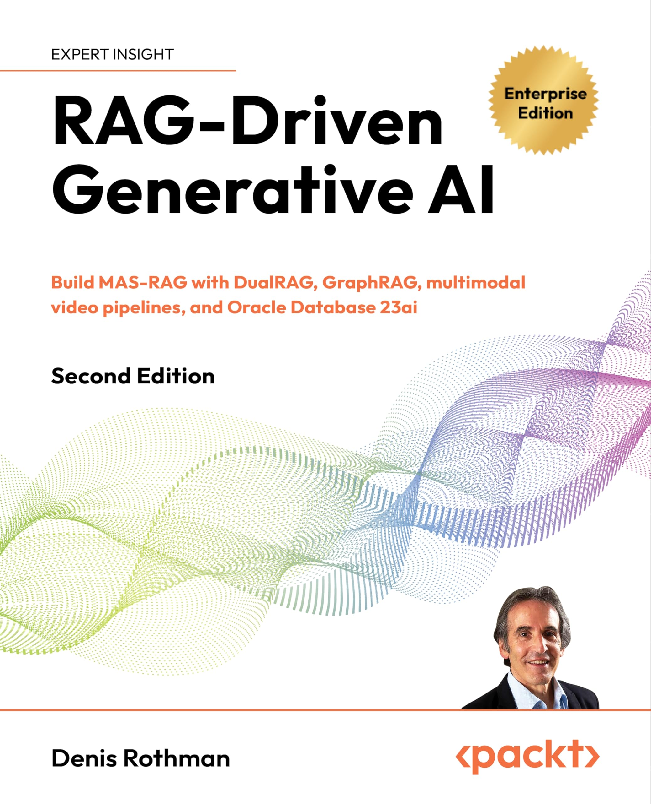

# RAG-Driven Generative AI - Second Edition — Mapa del libro

<p align="center"></p>

> [!info] Denis Rothman
> Mapa de lectura de *RAG-Driven Generative AI - Second Edition*. Abrí esta nota para la tesis del libro, el índice de capítulos y las ideas que cruzan toda la obra. Empezá por la tesis y bajá.

## 🎯 Tesis del libro

RAG (Retrieval-Augmented Generation) es el framework que le provee al modelo generativo el conocimiento que le falta: **empieza donde la IA generativa termina**, recuperando información optimizada y augmentando el input para producir outputs precisos y grounded en vez de alucinaciones. Esta segunda edición reencuadra RAG bajo un **cambio de paradigma**: pasar de la primera generación (RAG tradicional, con vector stores externos que obligan a sacar datos sensibles del entorno seguro) a la era **MAS-RAG (multi-agent systems for retrieval-augmented generation)** — **dejar de llevar los datos a la IA y empezar a llevar la IA a los datos**, sobre converged databases (Oracle Database 23ai) donde la vector search es nativa y los datos nunca cruzan el governance boundary (data sovereignty, Zero Trust).

El libro construye desde los fundamentos (las tres configuraciones naïve/advanced/modular, RAG vs fine-tuning, el ecosistema D·G·E·T) hacia la realidad enterprise y los sistemas multi-agente, donde el retrieval deja de ser mera recuperación y se vuelve **cognitive orchestration**: agentes autónomos que planifican, razonan y actúan donde viven los datos.

## 📖 Capítulos

| # | Capítulo | En una línea |
|---|---|---|
| 01 | [[01 - Why Retrieval-Augmented Generation]] | Define RAG, sus 3 configuraciones (naïve/advanced/modular), RAG vs fine-tuning, el ecosistema D·G·E·T, y los construye en Python simulando el paradigma MAS-RAG (traer la IA a los datos). |
| 02 | [[02 - RAG Embeddings in Oracle Vector Stores]] | De la simulación a la ingeniería real: vector store enterprise sobre Oracle 23ai en 3 notebooks (DBA→Engineer→Developer), arquitectura de simbiosis, dual RAG y pipeline Dual-Path que cita evidencia sin alucinar. |
| 03 | [[03 - Building a Live Recruiter Agent]] | Recruiter agent con hybrid RAG: vectoriza tablas relacionales Oracle y combina vector search (skills) + filtrado SQL (salario/experiencia) en una query sobre la converged database; personas de hiring dinámicas. |
| 04 | [[04 - Building Sovereign Enterprise Agents]] | De notebooks a software: refactoriza la lógica en módulos `.py` stateless con interfaz MCP — `OracleManager` (singleton), Archivist (no estructurado) y Recruiter (hybrid), validados en un unit-test notebook. Oracle 23ai plug-and-play. |
| 05 | [[05 - Building a Universal Context Engine]] | Unifica los agentes en un MAS-RAG cross-domain: engine indiferente al almacenamiento + `registry.py` (routing table) + Planner que elige agentes vía `get_capabilities_description()` (architectural prompt engineering); escenarios búsqueda+constraint+email. |
| 06 | [[06 - Operationalizing the Universal Context Engine]] | La última milla: control deck con `ipywidgets`, control flow event-driven (session state + event bridge + loop), trace dashboard glass-box, y troubleshooting real (hardening polimórfico, reconexión, business rules engine anti-bias). |
| 07 | [[07 - Empowering AI Models by Fine-Tuning RAG Data]] | Cuando el RAG cruza un umbral inmanejable, fine-tunear los datos *estáticos* (ciencia dura) para volverlos *parametric*: prepara SciQ en JSONL, fine-tunea GPT-4o-mini vía la API de OpenAI, monitorea jobs y analiza métricas (training loss). |
| 08 | [[08 - Boosting RAG Performance with Human Feedback]] | De competencia genérica a alineación experta vía **human feedback**: hybrid-adaptive RAG desde cero (Retriever/Generator/Evaluator) con un Simulation Ranking (1-5) que conmuta sin-RAG / feedback experto / RAG estándar; feedback loop visual (thumbs up/down → `expert_feedback.txt`). |
| 09 | [[09 - Building a Conversational RAG Agent]] | Entrada al **multimodal RAG** (video): arquitectura tri-planar, DBA console schema-as-code, verificación de ground truth con OpenCV, y un Video Store agent que vectoriza metadata y busca con `VECTOR_DISTANCE` sobre `MEDIA_SEGMENTS` para reproducir el clip exacto. |
| 10 | [[10 - Building an Agent with Spatial-RAG and GraphRAG]] | RAG más allá de la semántica: **Spatial-RAG** (`SDO_GEOMETRY`) + **GraphRAG** (SQL Property Graphs) nativos en la converged DB. Un hyper-Recruiter filtra por significado+dinero+ubicación+relaciones en un solo SQL (vector+spatial+graph engines). |
| 11 | [[11 - Scaling AI Workloads with Oracle Exadata]] | De aplicación a **RAGOps**: la velocidad de retrieval a escala. OCI + Exadata (AI Smart Scan evita el data movement tax); journey en 4 etapas (ingesta 50k idempotente, baseline, scaling elástico OCI SDK, verificación 1.8x); la CPU no distingue data random de meaningful. |
| 12 | [[12 - The Autonomous Database Architect]] | El cierre: de retrieval **probabilístico** a **ejecución determinística**. Un agente con privilegios de DBA percibe data cruda, diseña un schema, ejecuta el DDL y puebla sus tablas (Perceive-Plan-Act-Audit). Tres leyes de seguridad + schemas self-healing → la self-evolving database. |

## 🔗 Ideas transversales

Conceptos que cruzan varios capítulos (se llena a medida que aparecen):

- **MAS-RAG / traer la IA a los datos** — aparece en [[01 - Why Retrieval-Augmented Generation]] y [[02 - RAG Embeddings in Oracle Vector Stores]]; el cambio de paradigma central del libro: converged database segura en vez de vector stores externos. El cap. 2 lo ingenieriza como *arquitectura de simbiosis* (sovereign logic ↔ sovereign memory).
- **Las tres configuraciones (naïve · advanced · modular RAG)** — [[01 - Why Retrieval-Augmented Generation]]; keyword/exact → vector/semántico → orquestación dinámica; modular RAG es el stepping stone a MAS. El cap. 2 operacionaliza *advanced RAG* con vector search real (`VECTOR_DISTANCE`); el cap. 3 materializa el *modular/hybrid RAG* combinando filtrado SQL (naïve) + vector (advanced) en una sola query.
- **Las tres fases simétricas (DBA → Data Engineer → Developer)** — [[02 - RAG Embeddings in Oracle Vector Stores]] y [[03 - Building a Live Recruiter Agent]]; la metodología de implementación que se repite por capítulo (infraestructura → ingestión ETL → query aumentada), encarnada en tres roles/notebooks. El cap. 4 la trasciende: pasa de notebooks lineales a módulos `.py` (infra → agente no estructurado → agente estructurado → verification).
- **De script a software (modularización + MCP)** — [[04 - Building Sovereign Enterprise Agents]] → [[05 - Building a Universal Context Engine]]; desacoplar datos de razonamiento, agentes stateless con interfaz MCP, singleton; en el cap. 5 estos agentes se integran como especialistas seleccionados por el Planner.
- **Engine indiferente al almacenamiento + architectural prompt engineering** — [[05 - Building a Universal Context Engine]]; el reasoning engine estático se comunica solo con el `registry.py` (routing table); el Planner se "programa" vía las descripciones del registry, no hard-coding. MAS-RAG cross-domain (modular RAG del cap. 1 hecho sistema).
- **Glass-box / observabilidad / trust** — [[06 - Operationalizing the Universal Context Engine]]; trace dashboard que parsea el `ExecutionTrace` (tokens, JSON, agentes) para razonamiento auditable; separar el *thinking* del Planner de la *final answer*. El Evaluator (E2) del cap. 1 se vuelve UX workshops + business rules engine.
- **Robustez de producción (hardening + governance)** — [[06 - Operationalizing the Universal Context Engine]]; input polimórfico (`isinstance`), reconexión de red, fail-fast con business rules (anti-bias + estabilidad SQL); "arreglar" un prompt vago es decisión UX, no de código.
- **Converged database (vector + relacional en la misma fila)** — [[02 - RAG Embeddings in Oracle Vector Stores]] (vectores junto a data en `KNOWLEDGE_STORE`/`CONTEXT_LIBRARY`) → [[03 - Building a Live Recruiter Agent]] (data convergence llevada al extremo: `NUMBER` salary junto a `VECTOR(1536)` en `CANDIDATE_POOL` → hybrid search).
- **RAG vs fine-tuning (non-parametric vs parametric)** — [[01 - Why Retrieval-Augmented Generation]] → [[07 - Empowering AI Models by Fine-Tuning RAG Data]]; referenciar vs aprender; no excluyentes (RAG da hechos, fine-tuning enseña a interpretarlos). El cap. 7 **materializa el threshold**: fine-tunea datos estáticos (ciencia dura) para reducir el volumen de RAG.
- **El ecosistema D·G·E·T en acción** — el cap. 1 lo define, el cap. 2 lo mapea a Oracle, el [[07 - Empowering AI Models by Fine-Tuning RAG Data]] usa D1/D2/E1/E2/T2/G3/G4 (fine-tuning), y el [[08 - Boosting RAG Performance with Human Feedback]] usa D1/D4, G1/G2/G4, E1/E2 (con E2 como el ranking simulation 1-5 que dirige la estrategia).
- **Human feedback / human-in-the-loop / adaptive** — [[08 - Boosting RAG Performance with Human Feedback]]; de competencia genérica a alineación experta; el modular RAG del cap. 1 hecho *adaptive* (router por score 1-5); el Evaluator E2 del cap. 1/5 implementado como feedback loop visual que persiste el matiz experto. La metadata refinada por RLHF alimenta el [[09 - Building a Conversational RAG Agent]].
- **Multimodal RAG** — [[09 - Building a Conversational RAG Agent]]; del texto/relacional al **video**; arquitectura tri-planar (control/semantic/visual); el `VECTOR_DISTANCE` sobre `MEDIA_SEGMENTS` extiende el patrón vector de los caps. 2-3 a momentos visuales (in-video retrieval por timestamp).
- **Converged database (más allá de vector)** — [[02 - RAG Embeddings in Oracle Vector Stores]] (vector+relacional) → [[03 - Building a Live Recruiter Agent]] (hybrid: SQL+vector) → [[10 - Building an Agent with Spatial-RAG and GraphRAG]] (hyper: vector+spatial+graph en un SQL); evitar el *data movement tax* manteniendo todos los engines en el kernel de Oracle 23ai.
- **Hyper-RAG: Spatial-RAG + GraphRAG** — [[10 - Building an Agent with Spatial-RAG and GraphRAG]]; espacio (`SDO_GEOMETRY`) y relaciones (SQL Property Graphs / `GRAPH_TABLE`) como señales de retrieval first-class; un agente que razona por significado+dinero+ubicación+confianza.
- **RAGOps / infraestructura como capa de producción** — [[11 - Scaling AI Workloads with Oracle Exadata]]; la velocidad de retrieval depende de la infra (OCI + Exadata / AI Smart Scan); scaling elástico de OCPUs vía el OCI SDK; data sintética para predecir cargas reales. La capa que sostiene todo lo construido.
- **El universal Oracle DBA console (control plane)** — introducido en [[09 - Building a Conversational RAG Agent]], extendido en [[10 - Building an Agent with Spatial-RAG and GraphRAG]] (spatial+graph) y [[11 - Scaling AI Workloads with Oracle Exadata]] (benchmark); schema-as-code versionado, idempotente, sin SQL ad-hoc — la espina dorsal de la segunda mitad del libro. En [[12 - The Autonomous Database Architect]] el control plane se vuelve **auto-gestionado por el agente** (el DBA es la IA).
- **De RAG a ejecución determinística** — [[12 - The Autonomous Database Architect]]; el RAG probabilístico puede leer pero no contar; un agente con privilegios de DBA crea la estructura (DDL) para *computar* la respuesta. La cuarta era de la interacción con datos; cierra el arco parametric/non-parametric del cap. 1.
- **Schema-as-code / DBA console / idempotencia** — [[09 - Building a Conversational RAG Agent]]; externalizar las definiciones de tablas en `create_script.py` versionado; control plane unificado; chequear `user_tables` antes de crear/insertar para re-correr sin corromper.
- **El ecosistema D·G·E·T** — [[01 - Why Retrieval-Augmented Generation]] (abstracto) → [[02 - RAG Embeddings in Oracle Vector Stores]] (mapeado concreto a Oracle: D1–D4 dentro de la base, G1–G4 en el MAS Python, E1/E2).
- **Data sovereignty / governance boundary / Zero Trust** — [[01 - Why Retrieval-Augmented Generation]] y [[02 - RAG Embeddings in Oracle Vector Stores]]; los datos sensibles nunca dejan el entorno seguro; el cap. 2 lo demuestra con un incidente de ciberseguridad donde solo viajan queries/respuestas, nunca data en bulk.
- **Dual RAG (hechos + instrucciones)** — [[02 - RAG Embeddings in Oracle Vector Stores]]; guardar *semantic blueprints* (el "cómo") junto al *knowledge store* (el "qué"); pipeline Dual-Path que consulta ambos en paralelo.
- **Grounding sin alucinaciones** — [[02 - RAG Embeddings in Oracle Vector Stores]]; la IA se atiene a los hechos soberanos provistos y declara explícitamente lo no confirmado en vez de inventar.

## 🧩 Síntesis

El cap. 1 sienta los fundamentos: qué es RAG y por qué importa (los modelos no saben lo que no saben), las tres configuraciones, la decisión estratégica RAG vs fine-tuning, el ecosistema de cuatro dominios, y una implementación Python desde cero de los tres tipos sobre un trust boundary simulado. El hilo conductor es el paradigma **MAS-RAG**: la maduración de la IA enterprise como un pipeline convergido y soberano en vez de un stack fragmentado de tools externas. El `RetrievalComponent` modular construido aquí es la semilla del resto del libro, que lo expandirá hacia agentes autónomos coordinados en un MAS.

El cap. 2 baja de la simulación a la **ingeniería real**: construye un vector store enterprise sobre **Oracle Database 23ai** en tres notebooks que encarnan tres roles (DBA → Data Engineer → Developer). Formaliza la **arquitectura de simbiosis** (un MAS Python agnóstico —*sovereign logic*— acoplado a la base inmutable —*sovereign memory*—), mapea el ecosistema D·G·E·T abstracto a componentes Oracle concretos (`VECTOR(1536)`, `VECTOR_DISTANCE`, operador `<->`), e introduce el **dual RAG** (guardar instrucciones junto a hechos) y un **pipeline Dual-Path** que recupera context+knowledge en paralelo. El caso de uso —un incidente de ciberseguridad— prueba que la IA puede correlacionar evidencia heterogénea (logs, tickets, Slack, políticas), citar CVE/timestamps/IPs y **negarse a alucinar** lo que la evidencia no confirma.

El cap. 3 mantiene la **misma metodología de 3 fases** pero se mueve **dentro del motor de la base**: en vez de archivos, vectoriza **tablas relacionales Oracle** y construye un **Recruiter agent con hybrid RAG**. Lleva la *converged database* al extremo (data convergence: `NUMBER` salary junto a `VECTOR(1536)` en la misma fila de `CANDIDATE_POOL`), demostrando **hybrid search** — combinar filtrado SQL duro (`WHERE salary <= ...`) con ranking semántico (`VECTOR_DISTANCE(..., DOT)`) en una sola query —, ingestión **dual-stream** (hechos a SQL vía `MERGE` idempotente, narrativa a vectores vía enrichment) y **hiring personas** recuperadas dinámicamente de la base para que el LLM cambie su rúbrica on demand. El resultado: una IA que es a la vez creativa y compliant con constraints rígidos.

El cap. 4 cambia el rol de *data scientist* a *enterprise software engineer*: **refactoriza** la lógica de los caps. 2-3 en **módulos `.py` stateless** que exponen una interfaz **MCP (Model Context Protocol)** estandarizada, desacoplando la capa de datos de la de razonamiento. Construye un `OracleManager` **singleton** (conexión centralizada, heartbeat, context manager), el **Oracle Archivist** (agente no estructurado sobre `KNOWLEDGE_STORE`) y el **Oracle Recruiter** (agente hybrid sobre `CANDIDATE_POOL`), y los valida en una **verification suite** (unit-test notebook). El notebook pasa a ser un engine/orquestador mínimo; Oracle 23ai se vuelve un componente **plug-and-play** para cualquier framework agéntico.

El cap. 5 da el salto de *component construction* a *system unification*: el **Universal Context Engine**, un MAS-RAG cross-domain cuya tesis es que **el reasoning engine debe ser indiferente al medio de almacenamiento**. El engine estático se comunica solo con el `registry.py` (routing table que desacopla el *How* del *Nature*), y un **Planner** (LLM) elige los agentes dinámicamente según el `get_capabilities_description()` — *architectural prompt engineering*: el manual de instrucciones del Planner vive en el registry. Integra los agentes del cap. 4 (Archivist, Recruiter) con el core engine library (CEL), configura un runtime híbrido (OpenAI + `OracleManager`) y prueba escenarios de convergencia que encadenan búsqueda semántica + constraint SQL + generación de email. El engine permanece estático; el registry lo adapta.

El cap. 6 cierra la *última milla*: convierte el backend en una **aplicación usable**. Agrega una capa de presentación con `ipywidgets` (control deck: presets + textarea), **invierte el control flow a event-driven** (session state persistente, event bridge, loop interactivo) y construye un **trace dashboard glass-box** que parsea el `ExecutionTrace` (tokens, JSON, decisiones del Planner) para razonamiento auditable. Dedica gran parte a **troubleshooting real**: hardening polimórfico del Recruiter (`isinstance` para dict o string), feedback de UI (`try...finally`), reconexión de red (`ensure_oracle_connection`) y un **business rules engine** (`validate_prompt`) que rechaza prompts non-compliant antes del engine (anti-bias + estabilidad SQL, fail fast). Lección clave: "arreglar" un prompt vago es un problema de UX (workshop con stakeholders), no de código.

El cap. 7 cierra el "loop" hacia el principio del cap. 1: cuando el volumen de RAG cruza un **umbral inmanejable**, los **datos estáticos** (ciencia dura, estables en el tiempo) pueden **fine-tunearse para reducir la masa de RAG** — convertir conocimiento *non-parametric* en *parametric*. Prepara el dataset **SciQ** (question→answer+support) en JSONL, fine-tunea **GPT-4o-mini** vía la API de OpenAI, monitorea los jobs (DataFrame, emails success/failure) y analiza las métricas (training loss 1.1570, hiperparámetros, usage). Usa explícitamente los componentes D1/D2/E1/E2/T2/G3/G4 del ecosistema.

El cap. 8 lleva el human feedback al centro: en 2026 conectar a un LLM es commodity, pero los usuarios **rechazan respuestas genéricas** aunque sean correctas — el problema es el *vibe*, no la corrección factual. Se construye un **hybrid-adaptive RAG** desde cero (Retriever scrapeando Wikipedia como ground truth / Generator / Evaluator) con un **Simulation Ranking (1-5)** que actúa como router: rank 1-2 sin RAG (respuesta nativa), 3-4 inyecta notas de expertos (`human_feedback.txt`), 5 RAG estándar. El Evaluator combina métricas automáticas (response time, cosine similarity TF-IDF) con un **feedback loop humano visual** (thumbs up/down → `expert_feedback.txt`) que captura el matiz experto que las métricas no detectan, cerrando el loop entre intención humana y output de máquina. Caso: *Company C* (soporte de C-phone).

El cap. 9 entra al **multimodal RAG**: del texto/relacional al **video**. Arquitectura **tri-planar** (control/semantic/visual plane) con un repo remoto + 3 notebooks. Profesionaliza la infra con un **Oracle DBA console** (*schema-as-code*: definiciones externalizadas en un `create_script.py` versionado, deployment determinístico sin configuration drift), verifica el ground truth de videos AI-generados (Sora) con **OpenCV** (frame rates, thumbnails), y construye un **conversational Video Store agent**: un esquema dual `MEDIA_ASSETS` (catálogo) + `MEDIA_SEGMENTS` (vectores `VECTOR(1536, FLOAT32)` con timestamp para in-video retrieval), ingesta **idempotente**, y una clase que combina **JOIN + `VECTOR_DISTANCE`** sobre la converged database, sintetiza con GPT-4o citando filename+timestamp, y reproduce el clip exacto (auto-seek `#t=`). La metadata fue refinada por el RLHF del cap. 8.

El cap. 10 extiende RAG **más allá de la semántica**: introduce **espacio y relaciones como señales de retrieval first-class**. **Spatial-RAG** (motor `SDO_GEOMETRY` nativo) + **GraphRAG** (SQL Property Graphs / SQL/PGQ), ambos dentro de la **converged database** de Oracle 23ai → razonamiento spatial+graph+vector+relacional en **un único SQL**, evitando el *data movement tax* (no ETL a GIS externos ni graph DBs). Construye sobre el DBA console del cap. 9 (5 updates, sin SQL ad-hoc) y crea un **hyper-contextual Recruiter**: una shadow table `CANDIDATE_POOL_GEO` (con `home_location`), un property graph `recruitment_graph` (EMPLOYEES↔REFERRALS), y una **hyper-query** que combina `VECTOR_DISTANCE` (skill) + `SDO_GEOM.SDO_DISTANCE` (radio) + `GRAPH_TABLE MATCH` (trust path), envuelta en GPT-5.2 que valora **trust y presence tanto como skill**. El cap. 11 transiciona de application design a **production engineering / RAGOps**: la velocidad de retrieval es el requisito enterprise. Con **OCI + Oracle Exadata** (AI Smart Scan offloadea los cálculos de vector distance a las storage cells con NVMe flash, eliminando el *data movement tax*) se mantiene sub-segundo a escala. El journey en 4 etapas: ingesta de 50k filas sintéticas (idempotente, `executemany`, ~2s), baseline (stress test CPU full-scan), scaling elástico (OCI Python SDK ajusta los OCPUs), verificación (1.8x más rápido). Cierra probando que la CPU consume lo mismo para data random que meaningful (mismos FLOPS) → validez de usar data sintética.

El cap. 12 (final) cruza la frontera de **retrieval pasivo/probabilístico a ejecución determinística**: el RAG puede *leer* pero no *contar* (no hace agregación exacta sobre data nunca modelada). El **Autonomous Database Architect** es un agente con privilegios de DBA y skills de data engineer que **percibe data cruda, diseña un schema, ejecuta el DDL y puebla sus propias tablas** — la cuarta era de la interacción con datos (el LLM como *fuzzy-logic compiler*). Loop **Perceive-Plan-Act-Audit** sobre tres componentes (Architect, ETL Worker con schema reflection, Governance con `AGENT_SCHEMA_REGISTRY`), validado en logs de IT y crisis de supply chain, con anatomía del prompt DDL (persona/JSON/type inference/safety), **tres leyes de seguridad autónoma** (isolation/auditability/reversibility) y schemas **self-healing** (reactive evolution ante data drift). El cierre del libro: una categoría nueva de software, la **self-evolving database** — y el arco completo de bringing AI to the data, de la teoría del cap. 1 al agente que se construye su propia memoria.

## 🌱 Conceptos para enlazar / escribir

- [[_RAG|RAG]] · [[Enterprise RAG Assistant]] · [[Hybrid Search]] · [[Chunking Strategies]] · [[Reranking]] — patrón RAG y técnicas ya existentes en el vault.
- [[Change Data Capture]] · [[ACL Filtering en RAG]] — freshness y data sovereignty en el RAG del vault.
- [[Grounding]] · [[Hallucinations]] · [[Function Calling]] · [[Tool Calling]] · [[Orchestrator]] — conceptos del vault que el libro toca.
- **MAS-RAG · Oracle Converged Database · Oracle Database 23ai · Oracle AI Vector Search · Naïve/Advanced/Modular/Agentic RAG · Integrated vectorization · Embeddings · Cosine Similarity · TF-IDF · HNSW · IVF · Data sovereignty · Parametric/non-parametric knowledge · Fine-tuning · Multi-Agent Systems** — candidatos a nota propia seedeados por el cap. 1.
- **`VECTOR(1536)` · `VECTOR_DISTANCE` · operador `<->` (Euclidean) · `text-embedding-3-small` · tiktoken · Chunking (overlap) · Exponential backoff (tenacity) · Dual RAG · Context Library / Knowledge Store · Semantic blueprints · Dual-Path RAG pipeline · Autonomous Database · Oracle Wallet · `oracledb` (Thin Client) · CLOB/LOB · DDL/`TRUNCATE` · RCA** — candidatos a nota propia seedeados por el cap. 2.
- **Converged Database / Data convergence · Hybrid RAG / Hybrid Search · `VECTOR_DISTANCE(..., DOT)` (dot product) · SQL `MERGE` (idempotencia) · Dual-stream ingestion · Vector enrichment · `DROP TABLE ... PURGE` / `ORA-00942` · Hiring personas · Context injection · NLU · Filtered vector search** — candidatos a nota propia seedeados por el cap. 3.
- **MCP (Model Context Protocol) · Singleton pattern (`OracleManager`) · Context manager (`get_cursor`) · Interface pattern · Stateless agents · Dependency injection · Sovereign agents · Oracle Archivist / Oracle Recruiter · Universal Context Engine · Connection pooling · Heartbeat check · Unit test suite** — candidatos a nota propia seedeados por el cap. 4.
- **Universal Context Engine · Core Engine Library (CEL) · Context engineering · Registry / routing table · Planner-Executor · `get_capabilities_description()` · Architectural prompt engineering · Dynamic capability provider · Glass-box architecture · Execution traces / token analytics · MAS-RAG cross-domain · ReAct · Reflexion** — candidatos a nota propia seedeados por el cap. 5.
- **Operationalization · `ipywidgets` (VBox/HBox/Accordion/Dropdown/Textarea) · Session state · Event-driven / event bridge · `ExecutionTrace` / trace dashboard · Polymorphic input handling (`isinstance`) · Business rules engine / `validate_prompt` · Anti-bias guardrails · `ensure_oracle_connection` · Fail fast · UX workshop · Planner-Writer chaining** — candidatos a nota propia seedeados por el cap. 6.
- **SciQ dataset · Allen Institute for AI (AI2) · Static vs dynamic RAG data · Fine-tuning threshold · JSONL prompt-completion · Supervised fine-tuning (SFT) · GPT-4o-mini · Hugging Face datasets / Parquet · Distractors · Training loss · Epochs / batch size / LR multiplier / seed · Cutoff date** — candidatos a nota propia seedeados por el cap. 7. (Ya existen en el vault: [[_MLOps|MLOps]], [[RLHF]].)
- **Human feedback (HF) · Hybrid-adaptive RAG · Adaptive RAG · Simulation Ranking (1-5) · Human-in-the-loop alignment · Domain alignment / vibe · Ground truth (Wikipedia scraping) · BeautifulSoup / User-Agent · Cosine similarity / TF-IDF · `expert_feedback.txt` / flashcards · Thumbs up/down feedback UI** — candidatos a nota propia seedeados por el cap. 8.
- **Multimodal RAG · In-video retrieval · Tri-planar architecture · Schema-as-code / configuration drift · DBA console / `create_script.py` registry · Idempotency (`user_tables` / `ORA-00955`) · `MEDIA_ASSETS` / `MEDIA_SEGMENTS` · `VECTOR(1536, FLOAT32)` · `RETURNING ... INTO` · `executemany` · OpenCV (`cv2`) · OpenAI Sora · Base64 video player / `#t=` auto-seek · GPT-4o** — candidatos a nota propia seedeados por el cap. 9.
- **Spatial-RAG · GraphRAG · Converged database / polyglot persistence · `SDO_GEOMETRY` / `SDO_GEOM.SDO_DISTANCE` · SRID 4326 (WGS 84) · GIS · SQL Property Graphs / SQL/PGQ · `GRAPH_TABLE` / `MATCH` / `CREATE PROPERTY GRAPH` · vertex/edge tables · HNSW / IVF · FLOAT32/INT8/BINARY · Data movement tax · `python-oracledb` thin mode · `ORA-12860` · Hyper-query · Shadow table** — candidatos a nota propia seedeados por el cap. 10.
- **RAGOps · Oracle Exadata · AI Smart Scan · OCI / OCI Python SDK · OCPUs · Elasticity / programmatic scaling · NVMe flash · Engineered system · Autonomous Database Free Tier · `executemany` · Full table scan · Dimensionality $O(d)$ · FLOPS · CPU equivalence · Circuit breaker · `cpu_core_count` / `UpdateAutonomousDatabaseDetails`** — candidatos a nota propia seedeados por el cap. 11.
- **Autonomous Database Architect · Self-evolving database · Perceive-Plan-Act-Audit · Deterministic vs probabilistic RAG · DDL/DML autonomy · `AGENT_SCHEMA_REGISTRY` · Schema reflection (`user_tab_columns`) · JSON mode enforcement · Type inference · Fuzzy-logic compiler · Three laws (isolation/auditability/reversibility) · Sandbox schema · Reactive schema evolution / self-healing · Schema drift · Bimodal IT (core/edge) · `ALTER TABLE` / `ORA-00913`** — candidatos a nota propia seedeados por el cap. 12.

## 🔍 Todos los capítulos (auto)

```dataview
TABLE autor AS "Autor", capitulo AS "Cap."
FROM "Libros/RAG-Driven Generative AI - Second Edition"
WHERE capitulo
SORT capitulo ASC
```
